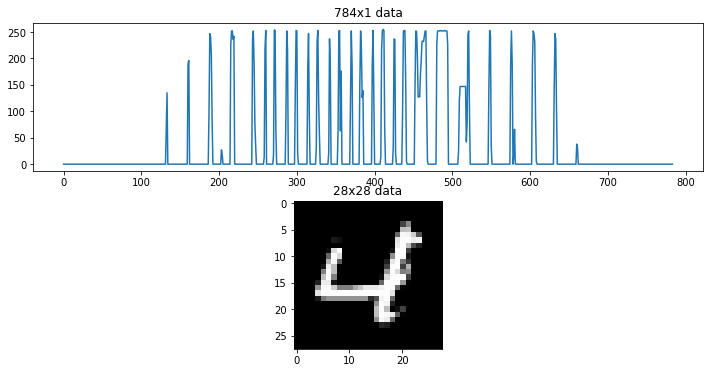
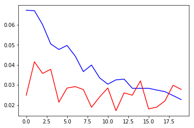
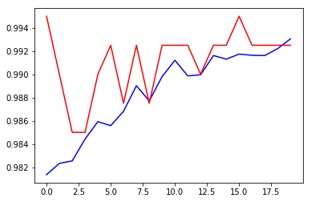

```python
import numpy as np 
import pandas as pd
import tensorflow as tf
import matplotlib.pyplot as plt
%matplotlib inline
from sklearn.model_selection import train_test_split
from sklearn.metrics import confusion_matrix
```


```python
from keras.utils.np_utils import to_categorical # convert to one-hot-encoding
from keras.models import Sequential
from keras.layers import Dense, Dropout, Flatten, Conv2D, MaxPool2D, BatchNormalization
from keras.optimizers import Adam
from keras.preprocessing.image import ImageDataGenerator
from keras.callbacks import LearningRateScheduler
```

    Using TensorFlow backend.


```python
train_file = "train.csv"
test_file = "test.csv"
output_file = "submission.csv"
```

# LOAD THE DATA


```python
raw_data = np.loadtxt(train_file, skiprows=1, dtype='int', delimiter=',')
x_train, x_val, y_train, y_val = train_test_split(raw_data[:,1:], raw_data[:,0], test_size=0.3)
```


```python
fig, ax = plt.subplots(2, 1, figsize=(12,6))
ax[0].plot(x_train[0])
ax[0].set_title('784x1 data')
ax[1].imshow(x_train[0].reshape(28,28), cmap='gray')
ax[1].set_title('28x28 data')
```


    Text(0.5,1,u'28x28 data')





```python
x_train = x_train.reshape(-1, 28, 28, 1)
x_val = x_val.reshape(-1, 28, 28, 1)
```


```python
x_train = x_train.astype("float32")/255
x_val = x_val.astype("float32")/255
```


```python
y_train = to_categorical(y_train)
y_val = to_categorical(y_val)
#example
print(y_train[0])
```

    [0. 0. 0. 0. 1. 0. 0. 0. 0. 0.]


# TRAIN THE MODEL
Keras offers two different ways of defining a network. We will the Sequential API, where you just add on one layer at a time, starting from the input.

The most important part are the convolutional layers Conv2D. Here they have 16-32 filters that use nine weights each to transform a pixel to a weighted average of itself and its eight neighbors. As the same nine weights are used over the whole image, the net will pick up features that are useful everywhere. As it is only nine weights, we can stack many convolutional layers on top of each other without running out of memory/time.

The MaxPooling layers just look at four neighboring pixels and picks the maximal value. This reduces the size of the image by half, and by combining convolutional and pooling layers, the net be able to combine its features to learn more global features of the image. In the end we use the features in two fully-connected (Dense) layers.

Batch Normalization is a technical trick to make training faster. Dropout is a regularization method, where the layer randomly replaces a proportion of its weights to zero for each training sample. This forces the net to learn features in a distributed way, not relying to much on a particular weight, and therefore improves generalization. 'relu' is the activation function x -> max(x,0).


```python
model = Sequential()

model.add(Conv2D(filters = 16, kernel_size = (3,3), activation='relu', input_shape = (28, 28, 1)))
model.add(BatchNormalization())
model.add(Conv2D(filters = 16, kernel_size = (3,3), activation='relu'))
model.add(BatchNormalization())
#model.add(Conv2D(filters = 16, kernel_size = (3,3), activation='relu'))
#model.add(BatchNormalization())
model.add(MaxPool2D(strides=(2,2)))
model.add(Dropout(0.25))

model.add(Conv2D(filters = 32, kernel_size = (3,3), activation='relu'))
model.add(BatchNormalization())
model.add(Conv2D(filters = 32, kernel_size = (3,3), activation='relu'))
model.add(BatchNormalization())
#model.add(Conv2D(filters = 32, kernel_size = (3,3), activation='relu'))
#model.add(BatchNormalization())
model.add(MaxPool2D(strides=(2,2)))
model.add(Dropout(0.25))

model.add(Flatten())
model.add(Dense(512, activation='relu'))
model.add(Dropout(0.25))
model.add(Dense(1024, activation='relu'))
model.add(Dropout(0.25))
model.add(Dense(10, activation="softmax"))

          
```

# Augmentation

Another important method to improve generalization is augmentation. This means generating more training data by randomly perturbing the images. If done in the right way, it can force the net to only learn translation-invariant features. If you train this model over hundreds of epochs, augmentation will definitely improve your performance. Here in the Kernel, we will only look at each image 4-5 times, so the difference is smaller. We use a Keras function for augmentation.


```python
datagen = ImageDataGenerator(zoom_range = 0.1, height_shift_range = 0.1, width_shift_range = 0.1, rotation_range = 10)
```

The model needs to be compiled before training can start. As our loss function, we use logloss which is called ''categorical_crossentropy" in Keras. Metrics is only used for evaluation. As optimizer, we could have used ordinary stochastic gradient descent (SGD), but Adam is faster.


```python
model.compile(optimizer= Adam(lr=1e-4,), loss='categorical_crossentropy', metrics=['accuracy'])
```

We train once with a smaller learning rate to ensure convergence. We then speed things up, only to reduce the learning rate by 10% every epoch. Keras has a function for this:


```python
annealer = LearningRateScheduler(lambda x: 1e-3 * 0.9 ** x)
```

We will use a very small validation set during training to save time in the kernel.


```python
hist = model.fit_generator(datagen.flow(x_train, y_train, batch_size=64),
                          steps_per_epoch=500,
                          epochs=20, #Increase this when not on kaggle kernel
                          verbose=2, #1 for ETA(progres_bar), 0 for silent
                          validation_data=(x_val[:400,:], y_val[:400,:]), #For speed
                          callbacks=[annealer])
```

    Epoch 1/20
     - 128s - loss: 0.0672 - acc: 0.9814 - val_loss: 0.0248 - val_acc: 0.9950
    Epoch 2/20
     - 138s - loss: 0.0670 - acc: 0.9823 - val_loss: 0.0415 - val_acc: 0.9900
    Epoch 3/20
     - 135s - loss: 0.0600 - acc: 0.9826 - val_loss: 0.0357 - val_acc: 0.9850
    Epoch 4/20
     - 141s - loss: 0.0504 - acc: 0.9844 - val_loss: 0.0378 - val_acc: 0.9850
    Epoch 5/20
     - 128s - loss: 0.0477 - acc: 0.9859 - val_loss: 0.0214 - val_acc: 0.9900
    Epoch 6/20
     - 143s - loss: 0.0496 - acc: 0.9856 - val_loss: 0.0284 - val_acc: 0.9925
    Epoch 7/20
     - 106s - loss: 0.0443 - acc: 0.9868 - val_loss: 0.0291 - val_acc: 0.9875
    Epoch 8/20
     - 124s - loss: 0.0366 - acc: 0.9890 - val_loss: 0.0277 - val_acc: 0.9925
    Epoch 9/20
     - 130s - loss: 0.0399 - acc: 0.9877 - val_loss: 0.0188 - val_acc: 0.9875
    Epoch 10/20
     - 136s - loss: 0.0334 - acc: 0.9898 - val_loss: 0.0240 - val_acc: 0.9925
    Epoch 11/20
     - 134s - loss: 0.0303 - acc: 0.9912 - val_loss: 0.0284 - val_acc: 0.9925
    Epoch 12/20
     - 132s - loss: 0.0327 - acc: 0.9898 - val_loss: 0.0171 - val_acc: 0.9925
    Epoch 13/20
     - 142s - loss: 0.0328 - acc: 0.9900 - val_loss: 0.0260 - val_acc: 0.9900
    Epoch 14/20
     - 138s - loss: 0.0283 - acc: 0.9916 - val_loss: 0.0248 - val_acc: 0.9925
    Epoch 15/20
     - 123s - loss: 0.0283 - acc: 0.9913 - val_loss: 0.0320 - val_acc: 0.9925
    Epoch 16/20
     - 136s - loss: 0.0283 - acc: 0.9917 - val_loss: 0.0180 - val_acc: 0.9950
    Epoch 17/20
     - 125s - loss: 0.0274 - acc: 0.9917 - val_loss: 0.0189 - val_acc: 0.9925
    Epoch 18/20
     - 132s - loss: 0.0266 - acc: 0.9916 - val_loss: 0.0220 - val_acc: 0.9925
    Epoch 19/20
     - 140s - loss: 0.0246 - acc: 0.9922 - val_loss: 0.0298 - val_acc: 0.9925
    Epoch 20/20
     - 161s - loss: 0.0226 - acc: 0.9931 - val_loss: 0.0277 - val_acc: 0.9925


# Evaluate

We only used a subset of the validation set during training, to save time. Now let's check performance on the whole validation set.


```python
final_loss, final_acc = model.evaluate(x_val, y_val, verbose=0)
print("Final loss: {0:.4f}, final accuracy: {1:.4f}".format(final_loss, final_acc))
```

    Final loss: 0.0196, final accuracy: 0.9944


```python
plt.plot(hist.history['loss'], color='b')
plt.plot(hist.history['val_loss'], color='r')
plt.show()
plt.plot(hist.history['acc'], color='b')
plt.plot(hist.history['val_acc'], color='r')
plt.show()

```








```python
y_hat = model.predict(x_val)
y_pred = np.argmax(y_hat, axis=1)
y_true = np.argmax(y_val, axis=1)
cm = confusion_matrix(y_true, y_pred)
print(cm)
```

    [[1242    0    0    0    0    0    4    0    1    0]
     [   0 1385    1    0    0    0    0    6    3    0]
     [   1    1 1225    2    0    0    0    3    1    1]
     [   0    0    0 1340    0    0    0    0    3    1]
     [   0    1    0    0 1195    0    1    1    0    8]
     [   1    0    0    3    0 1092    0    0    1    0]
     [   3    0    0    0    2    3 1258    0    1    0]
     [   0    1    5    1    0    0    0 1329    0    1]
     [   0    0    0    0    0    2    2    0 1219    0]
     [   1    0    1    0    1    0    0    1    1 1245]]


Not too bad, considering the minimal amount of training so far. In fact, we have only gone through the training data approximately five times. With proper training we should get really good results.

As you can see there are quite a few parameters that could be tweaked (number of layers, number of filters, Dropout parameters, learning rate, augmentation settings). This is often done with trial and error, and there is no easy shortcut.

Getting convergence should not be a problem, unless you use an extremely large learning rate. It's easy, however, to create a net that overfits, with perfect results on the training set and very poor results on the validation data. If this happens, you could try increasing the Dropout parameters, increase augmentation, or perhaps stop training earlier. If you instead wants to increase accuracy, try adding on two more layers, or increase the number of filters.

# Submit


```python
mnist_testset = np.loadtxt(test_file, skiprows=1, dtype='int', delimiter=',')
x_test = mnist_testset.astype("float32")
x_test = x_test.reshape(-1, 28, 28, 1)/255
```


```python
y_hat = model.predict(x_test, batch_size=64)
```

y_hat consists of class probabilities (corresponding to the one-hot encoding of the training labels). I now select the class with highest probability


```python
y_pred = np.argmax(y_hat, axis=1)
```


```python
with open(output_file, 'w') as f:
    f.write('ImageId,Label\n')
    for i in range(len(y_pred)):
        f.write("".join([str(i+1),',',str(y_pred[i]), '\n']))
```
